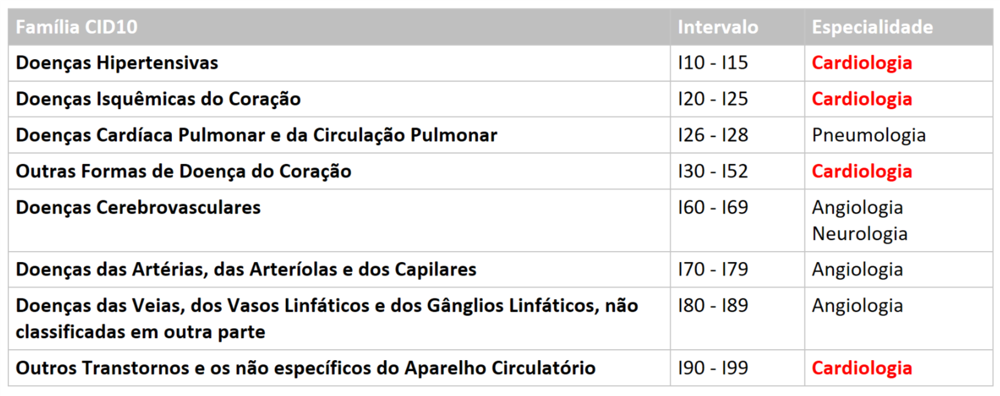

Este estudo faz parte da avaliação da propenção de Agravos relacionados à doenças Cardiacas no Brasil, assim está sendo avaliado os dados de Mortalidade (esta análise), casos Ambulatoriais e Hospitalares, bem como os profissionais de saúde Médicos Cardiologistas.

Este estudo pretende entender como se relacionam os casos de doenças cardiacas e a disponibilidade dos profissionais de saúde, bem como enxegar se a presença de cardiologistas auxilia de fato na redução de casos, ou seja, se a população se torna de mais saudável e cuida melhor da sua saúde, ou se é necessário alterarmos as politicas públicas atuais referentes às causalidades de cardiopatias.

Neste estudo iremos avaliar os casos de mortalidade relacionadas às doenças cardícas que, hoje, corresponde ao **Capítulo IX  - Doenças do aparelho circulatório (I00-I99)** da CID 10. Entretanto, como podem reparar pelo próprio título, trata-se do capítulo de doenças do aparelho circulatório, o que envolve também outras áreas da medicina além da Cardiologia, desta forma separamos os grupos de doenças deste capítulo por especialidades médicas após um estudo investigativo sobre cada uma das doenças.

```{r echo=FALSE, fig.align='center', fig.cap='...', out.width='25%'}

```

Uma vez com os resultados postos pela tabela acima, iremos apenas investigar as doenças dos primeiro, segundo, quarto e último grupo, como está em destaque a palavra **Cardiologia**.

A estrategia a ser abordada será refinar as entradas a partir das entradas que iniciem com a letra **I** e em um segundo momento fazer um novo refinamento com os intervalos desejados numericamente.

# 1. Avaliação de Caso de Estudo

Vamos pegar apenas um arquivo e construir a avaliação em cima dele, uma vez validado os processos refazemos com todo o conjundo de dados disponível.

Definindo o caminho dos dados:

```{r}
path_data <- "D:\\SIM" 
```

Carregando a biblioteca necessária para os arquivos:

```{r}
library(read.dbc)
library(dplyr)
library(future.apply)
```

Obtendo um arquivo para desenvolvimento dos testes e avaliação:

```{r warning=FALSE}
setwd(path_data)
dados <- read.dbc("DORN2011.dbc")
```

Visualizando a estrutura dos dados:

```{r}
str(dados)
```

Lista das variáveis a serem consideradas:

1. IDADE
1. SEXO
1. RACACOR
1. ESC
1. ESTCIV
1. CODMUNRES
1. LOCOCOR
1. CAUSABAS
1. DTOBITO

Criando uma função de filtro para as variáveis acima considerando apenas as mortes do Capítulo IX da CID10 como exposto anteriormente:

Primeiro, precisamos converter a coluna **CAUSABAS** em String:

```{r}
dados$CAUSABAS <- as.character(dados$CAUSABAS)
```


```{r}

reduced <- dados %>%
  select('IDADE','SEXO','RACACOR', 'ESC', 'ESTCIV','CODMUNRES', 'LOCOCOR', 'CAUSABAS', 'DTOBITO') %>%
  filter(startsWith(CAUSABAS, "I"))

reduced <- droplevels(reduced)

str(reduced)
```

Uma vez que não precisamos de cada informação especifica das doenças, iremos manter apenas os primeiros 3 caracteres da CID utilizada, removendo o quarto caracter quando este existir:

```{r}
reduced$CAUSABAS <- substr(reduced$CAUSABAS, 1, 3)
```

Verificando como ficaram os dados:

```{r}
str(reduced)
```

Agora é necessário filtrar as causas de morte conforme o quadro apresentado acima:

```{r}
grupoCID = function(dado){
  subgrupo <- as.numeric(substr(dado, 2, 3))
  
  if (between(subgrupo, 10, 15)) { 
    return("Doenças Hipertensivas") 
  } else if (between(subgrupo, 20, 25)) {
      return("Doenças Isquêmicas do Coração")
  } else if (between(subgrupo, 30, 52)) {
      return("Outras Formas de Doença do Coração")
  } else if (between(subgrupo, 90, 99)) {
      return("Casos não Específicos do Aparelho Circulatório")
  } else {
      return ("Outros")
  }
}
```

Criaremos uma nova coluna com as informações referentes ao agrupamento da doença:

```{r}
reduced$GRUPO <- sapply(reduced$CAUSABAS, grupoCID)
```

Vendo como ficou:

```{r}
str(reduced)
```

Visualizando como ficou a distribuição das variavéis:

```{r}
summary(reduced)
```

```{r}
grupos <- as.data.frame(table(reduced$GRUPO))

head(grupos)
```

# 2. Funções para Análise

## 2.1. Função de Classificação por Grupo de CID

```{r}
grupoCID = function(dado){
  subgrupo <- as.numeric(substr(dado, 2, 3))
  
  if (between(subgrupo, 10, 15)) { 
    return("Doenças Hipertensivas") 
  } else if (between(subgrupo, 20, 25)) {
      return("Doenças Isquêmicas do Coração")
  } else if (between(subgrupo, 30, 52)) {
      return("Outras Formas de Doença do Coração")
  } else if (between(subgrupo, 90, 99)) {
      return("Casos não Específicos do Aparelho Circulatório")
  } else {
      return ("Outros")
  }
}
```


## 2.2. Função de Redução

```{r}
reduce = function(data){
  data$CAUSABAS <- as.character(data$CAUSABAS)
  
  tmp <- data %>%
  select('IDADE','SEXO','RACACOR', 'ESC', 'ESTCIV','CODMUNRES', 'LOCOCOR', 'CAUSABAS', 'DTOBITO') %>%
  filter(startsWith(CAUSABAS, "I"))
  
  tmp$CAUSABAS <- substr(tmp$CAUSABAS, 1, 3)
  
  tmp <- droplevels(tmp)
  
  tmp$GRUPO <- sapply(tmp$CAUSABAS, grupoCID)
  
  return(tmp)
}
```

## 2.3. Abrir os arquivos DBCs

```{r}
readDBC = function(file){
  
  setwd(path_data)
  
  tmp <- read.dbc(file)
  
  res <- reduce(tmp)
  
  res <- droplevels(res)
  
  return(res)
}
```


# 3. Testando Paralelismo 

Detectando quantos cores existem disponíveis no pc

```{r}
parallel::detectCores()
```

Testando a leitura dos arquivos

```{r}
listoffiles <- list.files(path_data, pattern = "DO")

plan(multiprocess, workers = 2)

t1 <- Sys.time()

tempResult <- future_lapply(listoffiles, readDBC)

t2 <- Sys.time()

result <- do.call(rbind, tempResult)

t3 <- Sys.time()

str(result)

```

```{r}
length(listoffiles)
```

```{r}
gc()
```

Todo o processo de leitura, reducing e resulting levou 12min e 50seg, consumindo em média 80% do processamento do pc e atingindo em média 90% da memória. Contudo, ainda assim, foi mais rápido que o processo linear. Isso tudo sem aplicar o callback rbind.

Aplicando o rbind na função do.call, o tempo total foi de 17min e 05seg, a média de consumo dos recursos físicos foi basicamente o mesmo.

Sumarisando os dados para avaliarmos:

```{r}
summary(result)
```

Caso você deseje conferir os resultados obtidos aqui com os dados fornecidos pelo TABNET, lembre-se de filtrar as mesmas doenças utilizadas neste exemplo. O total geral de mortes para os dados disponiveis no TABNET é de 22.366.860, o total de entredas que permaneceram na base de dados resultante foi de 6.995.450, o que corresponde à 31,57%.

Tempo consumido no processo:

```{r}
print("Tempo abrindo os arquivos : ")
t2 - t1

print("Tempo fazendo o merge dos dados:")
t3 - t2
```

Adicionando a origem

```{r}
result$BASE <- "SIM"
```


Exportando o resultado final para um arquivo .csv:

```{r}

setwd("C:\\Users\\r_ds\\Documents\\Estudos\\Mortalidade\\Analises")

write.csv2(result, "mortalidade-cardio.csv",row.names=FALSE)

```


